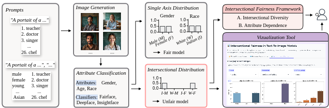
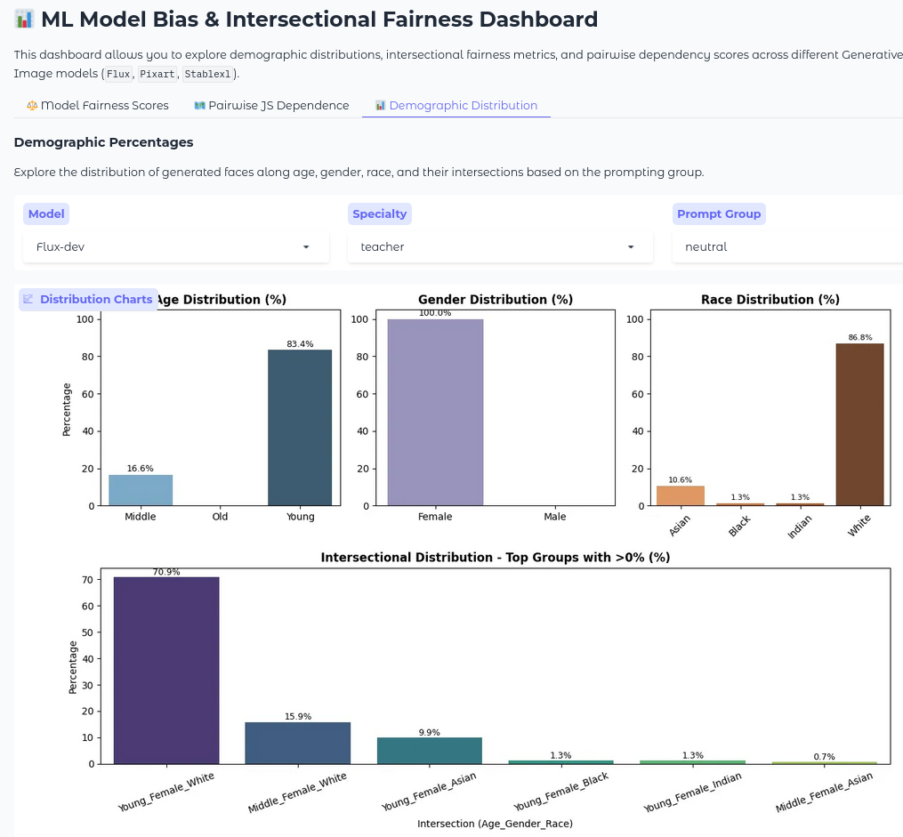

# Hidden Dependencies: Intersectional Bias in Text-to-Image Diffusion Models

This repository implements a framework for evaluating and visualizing intersectional bias in text-to-image generation models.

Text-to-image models can reproduce and amplify social biases present in their training data. This repository provides tools to systematically analyze representation bias across demographic attributes and their intersections, enabling a more comprehensive evaluation of fairness in generative models.

## Method Overview



The framework follows the steps illustrated in the method overview above:
1. Generate images from text prompts.
2. Classify generated images by demographic attributes.
3. Aggregate demographic predictions.
4. Compute and visualize fairness metrics.


## Interactive Dashboard

The framework includes an interactive dashboard for exploring fairness metrics, attribute dependence, and demographic distributions.

<p align="center">
  
</p>

Start the dashboard with:

```bash
python dashboard.py
```

## Project Structure

The repository is organized into four main modules: image generation, demographic classification, fairness evaluation, and experiment configurations.

```bash
├── classification/ # Demographic attribute prediction and post-processing
│ ├── analyzers/  # Models for demographic classification
│ ├── demographic_classification.py
│ └── postprocessing.py
├── evaluation/ # Fairness metrics and visualization
│ └── fairness.py  # Intersectional fairness metrics
├── experiments/ # Experiment scripts and generated results
│ ├── exp1/  # intersectional Fairness evaluation
│ │ ├── results/  # Experimental results
│ │ ├── config.py # Experiment configuration
│ │ └── start_experiment.py
│ ├── exp2/  # Prompt sensitivity analysis
│ └── exp3/  # Mitigation of intersectional bias
├── generation/ # Text-to-image model loading and prompt generation
│ ├── models/  # Models for text-to-image generation
│ └──prompts.py  # Text prompts for image generation
└── dashboard.py
```
- **`generation/`**  
  Contains components for generating images from text prompts, including model loading and prompt construction.
- **`classification/`**  
  Contains tools for extracting demographic attributes from generated images and aggregating predictions.
- **`evaluation/`**  
  Contains fairness metrics, analysis methods, and visualization utilities for evaluating representation and intersectional bias.
- **`experiments/`**  
  Contains the experiment pipelines used to reproduce the results. Each experiment defines a complete evaluation workflow.

## Installation
This framework was tested with Python 3.11.2. All dependencies are listed in `requirements.txt`.
Install the required packages using:

```bash
python3 -m venv env
source env/bin/activate
pip install -r requirements.txt
```
## Reproducing Results

Evaluation results are stored within each experiment directory.
To reproduce the experiments reported in the paper, use the provided configurations and run:

```bash
python experiments/{exp}/start_experiment.py
```

Each evaluation pipeline consists of image generation followed by demographic analysis and fairness evaluation. 

## Configuration
Each experiment can be configured through the provided configuration file, including the evaluated models, professions, demographic groups, and number of generated images.
- `MODELS`: text-to-image models to evaluate
- `PROFESSIONS`: target occupation prompts
- `GROUPS`: demographic groups for controlled generation
- `NUM_IMAGES`: number of samples per prompt
- `BATCH_SIZE*`: generation batch sizes


